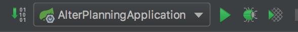

# AlterPlanning

## Description du projet

Ce projet est effectué dans le cadre du MS2I effectué à l'ENI.

Réalisé par le Groupe E durant l'année scolaire 2017 - 2018.

Ce projet a pour vocation de générer des calendriers pour les alternants de l'école ENI Informatique.

## Prérequis du projet

- Java JDK 1.8
- Maven 3.5.*
- NodeJS 9 ou +
- Angular CLI
- Mysql (ou MariaDB)
- SQLServer (Microsoft SQL Server 2017)
- Docker *(mac ou linux)*

## Description de l'application

### Structure de l'application

- [SpringBoot](https://spring.io/projects/spring-boot) : 

```shell
# Path to Spring App
src/main/java/fr/nantes/eni/alterplanning
```

- [Angular 5](https://v5.angular.io/docs) : 

```shell
# Path to Angular App
src/main/alter-app-client
```

### Application Serveur (Java)

- Démarrer l'application



- **ATTENTION !!** Pour démarrer l'application les bases SQLServer et MySQL doivent être lancées auquel cas l'application sera en erreur et ne démarrera pas.

- Pour modifier des paramètres de l'application il faut modifier le fichier suivant et rédémarrer l'application pour que les changement soient pris en compte :

```shell
# Path to application properties
src/main/resources/application.properties
```

### Application client (Angular)

La documentation de l'application cliente est présente à cette endroit : [Doc App CLient](src/main/alter-app-client/README.md)

Afin de démarrer l'application client il est nécéssaire d'installer les dépendances NPM en premier.

- Ce rendre dans le dossier de l'application client

```shell
# Path to Angular App
cd src/main/alter-app-client
```

- Installer les dépendances

```shell
# Install App dependencies
npm install
```

- Lancer l'application

```shell
# Start application
npm start
```

## Doc API (Swagger)

La documentation de chaque webservice est automatique générée à l'aide de l'outil swagger.

La description des webservices est présente en suivant l'url : [http://localhost:8080/swagger-ui.html](http://localhost:8080/swagger-ui.html)

## Mise en place SQLServer avec Docker

[Documentation mise en place SQLServer avec docker](docker/README.md)

## Builder l'application

Pour packager l'application Maven est utilisée.

Cette action a pour conséquence de builder l'application cliente, de l'intégrer aux resources du projet Java et de générer le war du projet.

- La commande pour générer le build est la suivante : 

```shell
# Remove old target folder and generate war
mvn clean package
```

- Le war est alors disponible dans le dossier `target/` sous le nom `alter-planning-[VERSION].war` ou `[VERSION]` représente la version déclarée dans le fichier `pom.xml`.